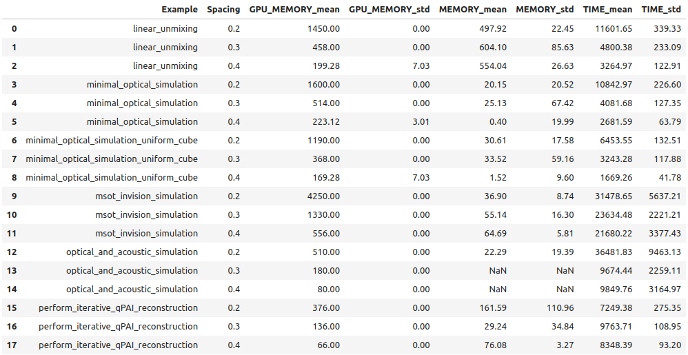

# Benchmarking SIMPA

## Overview
The [run_benchmarking.sh](../../simpa_examples/benchmarking/run_benchmarking.sh) bash script helps you benchmark
SIMPA simulations with various profiling options such as time, GPU memory, and memory usage.
It allows customization of initial spacing, final spacing, step size, output file location, and number of simulations.
To check and amend which simulations are run, see the [performance check script](../../simpa_examples/benchmarking/performance_check.py).

## Usage
To use this script, run it from the command line with the desired options. Please ensure you check two things before
running the script: First, ensure that the device will not be in use for the duration - ideally restart before 
benchmarking - of the benchmarking process, 
as this will create large uncertainties within the outcomes. Second, ensure that you don't accidentally write over any 
existing file by saving the files created by this script after runtime to different location.

The script will create multiple text files (eg. benchmarking_data_TIME_0.2.txt), showing the line by line profiling of
the most recent runs, as well as two csv's with the data from all the runs (benchmarking_data_frame.csv) and the means
and standard deviations of all the runs (benchmarking_data_frame_mean.csv).

Below is a description of the available options and how to use them.

### Benchmarking for contributions
When contributing, you may be asked by the development team to benchmarking the changes you've made to help them
understand how your changes have effected the performance of SIMPA. Therefore, we ask that you run this script with
**`-n, --number`** as 100 before AND after your changes, on a clean setup with no browser or other applications running.
Please put this in the conversation of the pull request, and not add it to the files of the pull request itself.


## Options
- **`-i, --init`**: First spacing to benchmark (default = 0.2mm).
- **`-c, --cease`**: Final spacing to benchmark (default = 0.4mm).
- **`-s, --step`**: Step between spacings (default = 0.1mm).
- **`-f, --file`**: Where to store the output files (default = save in current directory; 'print' prints it in console).
- **`-t, --time`**: Profile times taken (if no profile is specified, all are set).
- **`-g, --gpu`**: Profile GPU usage (if no profile is specified, all are set).
- **`-m, --memory`**: Profile memory usage (if no profile is specified, all are set).
- **`-n, --number`**: Number of simulations (default = 1).
- **`-h, --help`**: Display this help message.

## Default Values
If no options are provided for initial spacing, final spacing, or step size, the script uses the following default
values:
- **Initial Spacing**: 0.2mm
- **Final Spacing**: 0.4mm
- **Step Size**: 0.1mm

If no profiling options are specified, all three profilers (time, GPU memory, and memory) are used by default.

## Examples
Here are some examples of how to use the script:

1. **Default Usage**:
   ```bash
   bash ./run_benchmark.sh
   ```

2. **Custom Spacing and File Output**:
   ```bash
   bash ./run_benchmark.sh -i 0.1 -c 0.5 -s 0.05 -f results
   ```

3. **Profile Time and GPU Memory for 3 Simulations**:
   ```bash
   bash ./run_benchmark.sh -t -g -n 3
   ```

To read the csv you can use the following code:
```python
import pandas as pd
my_simpa_dir = '/home/user/workspace/...'
benchmarking_results = pd.read_csv(my_simpa_dir + 'simpa/simpa_examples/benchmarking/benchmarking_data_frame_mean.csv')
display(benchmarking_results)  # display works for ipynb - for py files use print(benchmarking_results)
```

The expected outcome should look something similar to the below:



# Line Profiler (more advanced - for specific function profiling)

Within SIMPA we have an [inbuilt python script](../../simpa/utils/profiling.py) to help benchmark specific functions and
understand the holdups in our code. This script is designed to set up a profiling environment based on an environment
variable named `SIMPA_PROFILE`. The `@profile` decorator can then be added to functions to see line-by-line statistics
of code performance.

Here is a breakdown of the script's functionality:

1. **Determine Profile Type and Stream:**
   - `profile_type` is fetched from the environment variable `SIMPA_PROFILE`.
   - `stream` is set to an open file object if the environment variable `SIMPA_PROFILE_SAVE_FILE` is set; otherwise, it is `None`.

2. **No Profiling:**
   - If `profile_type` is `None`

3. **Time Profiling:**
   - If `profile_type` is `"TIME"`

4. **Memory Profiling:**
   - If `profile_type` is `"MEMORY"`

5. **GPU Memory Profiling:**
   - If `profile_type` is `"GPU_MEMORY"`

6. **Profile Decorator**
   - The `profile` decorator is defined to register functions to be profiled and to print statistics upon program exit.

7. **Invalid Profile Type:**
   - If `profile_type` does not match any of the expected values (`"TIME"`, `"MEMORY"`, or `"GPU_MEMORY"`), a `RuntimeError` is raised.

### Example Usage

To use this script, you need to set the `SIMPA_PROFILE` environment variable to one of the supported values
(`TIME`, `MEMORY`, or `GPU_MEMORY`) and optionally set the `SIMPA_PROFILE_SAVE_FILE` to specify where to save the
profiling results.

The environment variables must be set before importing simpa in your python script like below.
```python
import os
os.environ("SIMPA_PROFILE")="TIME"
os.environ("SIMPA_PROFILE_SAVE_FILE")=profile_results.txt
```

To use the `@profile` decorator, simply apply it to the functions you want to profile within your script:

```python
@profile
def some_function():
    # function implementation
```

Make sure the necessary profiling modules (`line_profiler`, `memory_profiler`, `pytorch_memlab`) are installed in your
environment.