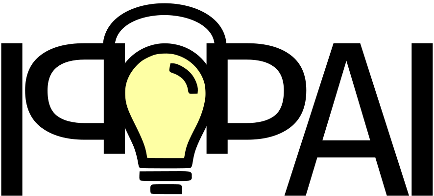

Welcome to IPPAI's documentation!
=================================

.. toctree::
   :maxdepth: 2
   :caption: Contents:

.. mdinclude::  ../../README.md

Examples
================

Performing a simple opical forward simulation
---------------------------------------------

The file can be found in samples/minimal_optical_simulation.py:

.. literalinclude:: ../../samples/minimal_optical_simulation.py
    :language: python
    :lines: 23-

Reading the HDF5 simulation output
----------------------------------

The file can be found in samples/access_saved_PAI_data.py:

.. literalinclude:: ../../samples/access_saved_PAI_data.py
    :language: python
    :lines: 23-

Defining custom tissue structures and properties
------------------------------------------------

The file can be found in samples/create_custom_tissues.py:

.. literalinclude:: ../../samples/create_custom_tissues.py
    :language: python
    :lines: 23-

Class references
================

Module: utils
-------------

.. automodule:: ippai.utils
    :members:

.. automodule:: ippai.utils.libraries
    :members:
.. automodule:: ippai.utils.libraries.chromophore_library
    :members:
.. automodule:: ippai.utils.libraries.literature_values
    :members:
.. automodule:: ippai.utils.libraries.spectra_library
    :members:
.. automodule:: ippai.utils.libraries.tissue_library
    :members:

Module: io_handling
-------------------

.. automodule:: ippai.io_handling
    :members:

.. automodule:: ippai.io_handling.io_hdf5
    :members:

Module: simulate
-------------------

.. automodule:: ippai.simulate
    :members:

.. automodule:: ippai.simulate.simulation
    :members:

.. automodule:: ippai.simulate.tissue_properties
    :members:

.. automodule:: ippai.simulate.volume_creator
    :members:

Conventions
^^^^^^^^^^^^^^^

.. automodule:: ippai.simulate.constants
    :members:

Structures
^^^^^^^^^^^^^^^

.. automodule:: ippai.simulate.structures
    :members:

Forward models
^^^^^^^^^^^^^^^

.. automodule:: ippai.simulate.models
    :members:

.. automodule:: ippai.simulate.models.optical_models
    :members:

.. automodule:: ippai.simulate.models.acoustic_models
    :members:

.. automodule:: ippai.simulate.models.reconstruction_models
    :members:

.. automodule:: ippai.simulate.models.noise_models
    :members:

