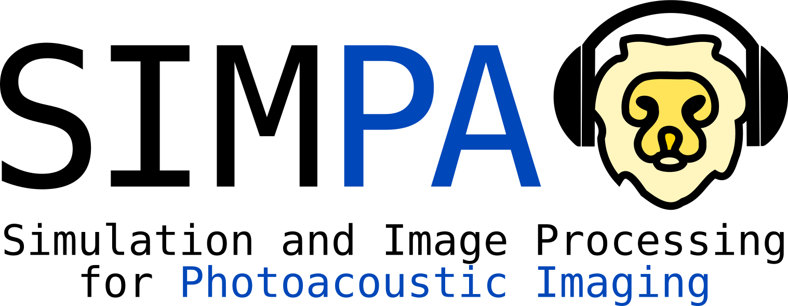

Welcome to the SIMPA documentation!
===================================

.. toctree::
   :maxdepth: 2
   :caption: Contents:

.. mdinclude::  ../../README.md

.. mdinclude::  ../../developer_guide.md

Class references
================

This component diagram shows the three principle modules
of the SIMPA toolkit and gives an insight into their constituents.
The core is concerned with providing interfaces for the
simulation tools, while the utils module contains many scripts
and classes to facilitate the use of the simulation pipeline.

.. image:: images/simpa_component_diagram.png
    :width: 20cm

Module: core
-------------------

The purpose of the core module is to provide interfaces that facilitate the integration of toolboxes and code for
photoacoustic modeling into a single continuous pipeline:

.. image:: images/pipeline_overview.png
    :width: 20cm

.. automodule:: simpa.core.simulation
    :members:

Volume creation
^^^^^^^^^^^^^^^^^^^^^^^^^^^

The core contribution of the SIMPA toolkit is the creation of in silico tissue-mimicking
phantoms. This feature is represented by the volume_creation module, that two main volume creation modules:
| Model-based creation of volumes using a set of rules
| Segmentation-based creation of volumes

.. automodule:: simpa.core.volume_creation
    :members:

.. automodule:: simpa.core.volume_creation.volume_creation
    :members:

Model-based volume creation
""""""""""""""""""""""""""""

.. automodule:: simpa.core.volume_creation.versatile_volume_creator
    :members:

Segmentation-based volume creation
"""""""""""""""""""""""""""""""""""

.. automodule:: simpa.core.volume_creation.segmentation_based_volume_creator
    :members:

Optical forward modeling
^^^^^^^^^^^^^^^^^^^^^^^^^^^

.. automodule:: simpa.core.optical_simulation.optical_modelling
    :members:

.. automodule:: simpa.core.optical_simulation
    :members:

.. automodule:: simpa.core.optical_simulation.illumination_definition
    :members:

mcx integration
""""""""""""""""""

.. automodule:: simpa.core.optical_simulation.mcx_adapter
    :members:

Acoustic forward modeling
^^^^^^^^^^^^^^^^^^^^^^^^^^^

.. automodule:: simpa.core.acoustic_simulation.acoustic_modelling
    :members:

.. automodule:: simpa.core.acoustic_simulation
    :members:

k-Wave integration
"""""""""""""""""""

.. automodule:: simpa.core.acoustic_simulation.k_wave_adapter
    :members:

Noise modeling
^^^^^^^^^^^^^^^^^^^^^^^^^^^

.. automodule:: simpa.core.noise_simulation.noise_modelling
    :members:

.. automodule:: simpa.core.noise_simulation
    :members:

Image reconstruction
^^^^^^^^^^^^^^^^^^^^^^^^^^^

.. automodule:: simpa.core.image_reconstruction.reconstruction_modelling
    :members:

.. automodule:: simpa.core.image_reconstruction
    :members:

Backprojection
"""""""""""""""""""""""""""""""

.. automodule:: simpa.core.image_reconstruction.BackprojectionAdapter
    :members:

Time Revearsal
"""""""""""""""""""""""""""""""

.. automodule:: simpa.core.image_reconstruction.TimeReversalAdapter
    :members:

Digital device twins
^^^^^^^^^^^^^^^^^^^^^

At every step along the forward simulation, knowledge of the photoacoustic device that is used for the measurements is
needed. This is important to reflect characteristic artefacts and challenges for the respective device.

To this end, we have included digital twins of commonly used devices into the SIMPA core.

MSOT Acuity Echo
""""""""""""""""""

.. automodule:: simpa.core.device_digital_twins.msot_devices
    :members:

RSOM Explorer P50
"""""""""""""""""""

.. automodule:: simpa.core.device_digital_twins.rsom_device
    :members:

Module: utils
-------------

The utils module contains several general-purpose utility functions whose purpose it is to facilitate
the use of SIMPA. The most important of these is the Tags class, which defines the strings and data types
that have to be used for the keys and values of the settings dictionary.

.. automodule:: simpa.utils.tags
    :members:

.. automodule:: simpa.utils.constants
    :members:

.. automodule:: simpa.utils.deformation_manager
    :members:

.. automodule:: simpa.utils.dict_path_manager
    :members:

.. automodule:: simpa.utils.settings_generator
    :members:

.. automodule:: simpa.utils.calculate
    :members:

.. automodule:: simpa.utils.tissue_properties
    :members:

Libraries
^^^^^^^^^^^^^^^^^^^^^

Another important aspect of the utils class is the libraries that are being provided.
These contain compilations of literature values for the acoustic and optical properties
of commonly used tissue.

.. automodule:: simpa.utils.libraries
    :members:
.. automodule:: simpa.utils.libraries.molecule_library
    :members:
.. automodule:: simpa.utils.libraries.literature_values
    :members:
.. automodule:: simpa.utils.libraries.spectra_library
    :members:
.. automodule:: simpa.utils.libraries.tissue_library
    :members:
.. automodule:: simpa.utils.libraries.structure_library
    :members:

Module: io_handling
-------------------

.. automodule:: simpa.io_handling
    :members:

.. automodule:: simpa.io_handling.io_hdf5
    :members:

Examples
================

Performing a complete forward simulation with acoustic modeling, optical modeling, as well as image reconstruction
--------------------------------------------------------------------------------------------------------------------

The file can be found in simpa_examples/minimal_optical_simulation.py:

.. literalinclude:: ../../simpa_examples/optical_and_acoustic_simulation.py
    :language: python
    :lines: 23-

Reading the HDF5 simulation output
----------------------------------

The file can be found in simpa_examples/access_saved_PAI_data.py:

.. literalinclude:: ../../simpa_examples/access_saved_PAI_data.py
    :language: python
    :lines: 23-

Defining custom tissue structures and properties
------------------------------------------------

The file can be found in simpa_examples/create_custom_tissues.py:

.. literalinclude:: ../../simpa_examples/create_custom_tissues.py
    :language: python
    :lines: 23-